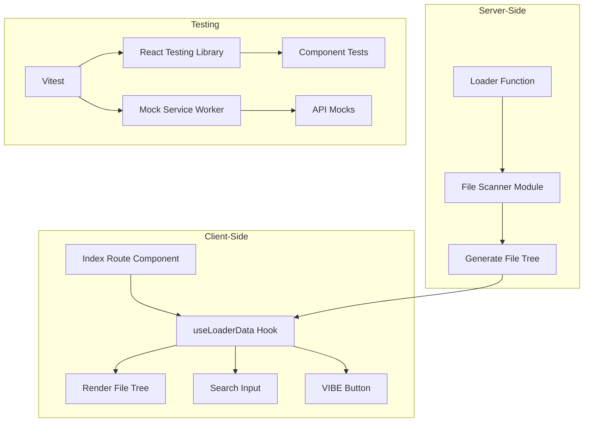
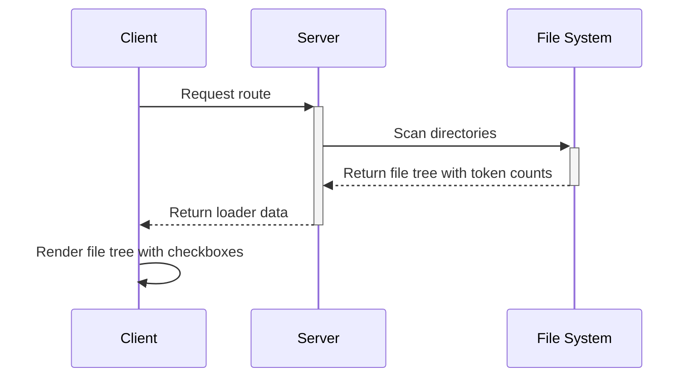
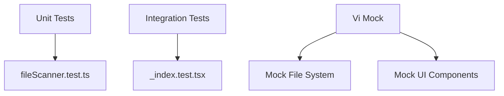

# Updated Implementation Plan: Server Data Loading and Testing

## Overview

This plan outlines the implementation of server data loading functionality with Vitest testing for the React Router 7 starter template. Based on the provided sample UI in `sample.tsx`, we'll enhance the template with:

1. A file system scanner that creates a nested tree structure matching the sample data structure
2. A loader in the index route that loads the file system data
3. Comprehensive tests with Vitest, React Testing Library, and MSW

## Architecture Diagram



## Data Flow Architecture



## Implementation Steps

### 1. Add Required Dependencies

```bash
bun add -d vitest @testing-library/react @testing-library/jest-dom jsdom msw @vitest/coverage-v8
```

### 2. Create Updated File System Scanner Module

Create a utility module that will scan the file system and generate a tree structure matching the sample:

```typescript
// app/lib/fileScanner.ts
import fs from 'node:fs';
import path from 'node:path';

export interface FileNode {
  name: string;
  tokens: number;
  type: "file" | "folder";
  checked: boolean;
  expanded?: boolean;
  children?: FileNode[];
  isPending?: boolean;
}

export interface FileData {
  root: FileNode;
}

// Helper function to calculate "tokens" (using file size as proxy)
function calculateTokens(filePath: string): number {
  try {
    const stats = fs.statSync(filePath);
    // Use file size as a proxy for token count
    // For real token counting, you would need a parser
    return Math.floor(stats.size / 4); // Rough estimate: 4 bytes per token
  } catch (error) {
    console.error(`Error calculating tokens for ${filePath}:`, error);
    return 0;
  }
}

export function scanDirectory(
  directoryPath: string, 
  excludePatterns: RegExp[] = [],
  isPendingPatterns: RegExp[] = [/node_modules/, /\.git/, /build/]
): FileNode {
  const baseName = path.basename(directoryPath);
  
  // Check if directory should be excluded or marked as pending
  const isPending = isPendingPatterns.some(pattern => pattern.test(directoryPath));
  
  if (excludePatterns.some(pattern => pattern.test(directoryPath))) {
    return {
      name: baseName,
      tokens: 0,
      type: "folder",
      checked: true,
      expanded: false,
      children: [],
      isPending
    };
  }

  let totalTokens = 0;
  const children: FileNode[] = [];

  try {
    const entries = fs.readdirSync(directoryPath, { withFileTypes: true });
    
    for (const entry of entries) {
      const entryPath = path.join(directoryPath, entry.name);
      
      // Skip excluded directories
      if (excludePatterns.some(pattern => pattern.test(entryPath))) {
        continue;
      }
      
      if (entry.isDirectory()) {
        const subDir = scanDirectory(entryPath, excludePatterns, isPendingPatterns);
        children.push(subDir);
        totalTokens += subDir.tokens;
      } else {
        const fileTokens = calculateTokens(entryPath);
        children.push({
          name: entry.name,
          tokens: fileTokens,
          type: "file",
          checked: true,
          isPending: false
        });
        totalTokens += fileTokens;
      }
    }
  } catch (error) {
    console.error(`Error scanning directory ${directoryPath}:`, error);
  }
  
  return {
    name: baseName,
    tokens: totalTokens,
    type: "folder",
    checked: true,
    expanded: true, // Root node starts expanded
    children,
    isPending
  };
}

export function createFileData(rootDir: string, excludePatterns: RegExp[] = []): FileData {
  const rootNode = scanDirectory(rootDir, excludePatterns);
  return { root: rootNode };
}
```

### 3. Update Index Route with Loader and Sample UI

```typescript
// app/routes/_index.tsx
import { json } from '@react-router/node';
import { useLoaderData } from 'react-router';
import { ChevronDown, ChevronRight } from 'lucide-react';
import { Button } from '~/components/ui/button';
import { Input } from '~/components/ui/input';
import { Checkbox } from '~/components/ui/checkbox';
import { createFileData, type FileData, type FileNode } from '~/lib/fileScanner';
import path from 'node:path';
import { useCallback, useState } from 'react';

import type { Route } from './+types/_index';

export function meta(_: Route.MetaArgs) {
  return [
    { title: 'React Router App - File Explorer' },
    { name: 'description', content: 'File explorer with server data loading' },
  ];
}

export async function loader() {
  // Get the project root directory
  const rootDir = path.resolve('.');
  
  // Scan the directory excluding specified patterns
  const fileData = createFileData(rootDir, [
    /node_modules\/.*/, // Exclude node_modules content but keep the folder
    /\.git\/.*/, // Exclude .git content but keep the folder
    /build\/.*/ // Exclude build content but keep the folder
  ]);
  
  return json<FileData>(fileData);
}

export default function Home() {
  const fileData = useLoaderData<typeof loader>();
  const [searchText, setSearchText] = useState("");
  const [localFileData, setLocalFileData] = useState<FileData>(fileData);
  
  // Toggle checkbox state
  const toggleCheckbox = (path: string[]) => {
    const newFileData = { ...localFileData };
    let current: FileNode | undefined = newFileData.root;
    
    // Skip root node if path doesn't include it
    if (current && path.length > 0 && path[0] === current.name) {
      for (let i = 1; i < path.length; i++) {
        const childName = path[i];
        // Ensure current exists and has children before finding index
        const childIndex: number | undefined = current?.children?.findIndex(child => child.name === childName);

        // Check for valid index
        if (childIndex !== undefined && childIndex !== -1 && current?.children) {
          current = current.children[childIndex];
        } else {
          console.error("Path not found or invalid structure for checkbox toggle:", path);
          return; // Path segment not found or current is not a folder
        }
      }

      // Check if current is still valid before toggling
      if (current) {
        current.checked = !current.checked;
        setLocalFileData(newFileData);
      }
    }
  };

  // Toggle folder expansion
  const toggleFolder = (path: string[]) => {
    const newFileData = { ...localFileData };
    let current: FileNode | undefined = newFileData.root;
    
    // Skip root node if path doesn't include it
    if (current && path.length > 0 && path[0] === current.name) {
      for (let i = 1; i < path.length; i++) {
        const childName = path[i];
        // Ensure current exists and has children before finding index
        const childIndex: number | undefined = current?.children?.findIndex(child => child.name === childName);

        // Check for valid index
        if (childIndex !== undefined && childIndex !== -1 && current?.children) {
           current = current.children[childIndex];
        } else {
           console.error("Path not found or invalid structure for folder toggle:", path);
           return; // Path segment not found or current is not a folder
        }
      }

      // Check if current is still valid and is a folder before toggling
      if (current && current.type === 'folder') {
        current.expanded = !current.expanded;
        setLocalFileData(newFileData);
      }
    }
  };

  // Recursive function to render file tree
  const renderFileTree = (node: FileNode, path: string[] = [], level = 0): React.ReactNode => {
    const currentPath = [...path, node.name];
    
    return (
      <div key={currentPath.join('/')} style={{ marginLeft: `${level * 16}px` }}>
        <div 
          className={`flex items-center py-1 ${node.isPending ? 'text-blue-500' : ''}`}
        >
          <Checkbox className="mr-2" checked={node.checked} onCheckedChange={() => toggleCheckbox(currentPath)} id={currentPath.join('/')} />

          {node.type === 'folder' && (
            <span
              className="mr-1 cursor-pointer"
              onClick={() => toggleFolder(currentPath)}
            >
              {node.expanded ? <ChevronDown size={16} /> : <ChevronRight size={16} />}
            </span>
          )}

          <label
            htmlFor={currentPath.join('/')}
            className={`mr-1 cursor-pointer ${!node.checked ? 'line-through opacity-50' : ''}`}
          >
            {node.name}
          </label>
          <span className={`text-xs text-gray-500 ${!node.checked ? 'line-through opacity-50' : ''}`}>({node.tokens} tokens)</span>
        </div>

        {node.type === 'folder' && node.expanded && node.children && (
          <div>
            {node.children.map((child: FileNode) => renderFileTree(child, currentPath, level + 1))}
          </div>
        )}
      </div>
    );
  };

  const handleVibe = () => {
    // Handle the VIBE button click
    console.log("VIBE clicked with text:", searchText);
    // You could add API calls or other functionality here
  };

  return (
    <div className="bg-gray-800 p-4 min-h-screen">
      <div className="max-w-3xl mx-auto">
        {/* Search bar and VIBE button */}
        <div className="flex mb-4 space-x-2">
          <Input
            value={searchText}
            onChange={(e) => setSearchText(e.target.value)}
            placeholder="foo"
            className="flex-grow bg-white text-black"
          />
          <Button
            onClick={handleVibe}
            className="bg-pink-600 hover:bg-pink-700 text-white font-bold"
          >
            VIBE
          </Button>
        </div>

        {/* File tree */}
        <div className="bg-gray-800 p-4 rounded-md text-white font-mono text-sm">
          {renderFileTree(localFileData.root)}
        </div>
      </div>
    </div>
  );
}
```

### 4. Configure Vitest

Create a Vitest configuration file:

```typescript
// vitest.config.ts
import { defineConfig } from 'vitest/config';
import react from '@vitejs/plugin-react';
import { fileURLToPath } from 'node:url';
import { dirname, resolve } from 'node:path';

const __dirname = dirname(fileURLToPath(import.meta.url));

export default defineConfig({
  plugins: [react()],
  test: {
    environment: 'jsdom',
    globals: true,
    setupFiles: ['./test/setup.ts'],
    include: ['**/*.test.{ts,tsx}'],
    coverage: {
      provider: 'v8',
      reporter: ['text', 'json', 'html'],
    },
  },
  resolve: {
    alias: {
      '~': resolve(__dirname, './app'),
    },
  },
});
```

### 5. Create Test Setup File

```typescript
// test/setup.ts
import '@testing-library/jest-dom';
import { afterAll, afterEach, beforeAll } from 'vitest';
import { cleanup } from '@testing-library/react';

// Setup
beforeAll(() => {
  // Any global setup
});

afterEach(() => {
  cleanup();
});

afterAll(() => {
  // Any global teardown
});
```

### 6. Create Tests

#### File Scanner Tests

```typescript
// app/lib/fileScanner.test.ts
import { describe, it, expect, vi } from 'vitest';
import { scanDirectory, createFileData } from './fileScanner';
import fs from 'node:fs';
import path from 'node:path';

vi.mock('node:fs', () => ({
  readdirSync: vi.fn(),
  statSync: vi.fn(),
}));

vi.mock('node:path', () => ({
  ...vi.importActual('node:path'),
  basename: vi.fn(),
  join: vi.fn((dir, file) => `${dir}/${file}`),
}));

describe('fileScanner', () => {
  it('should scan a directory and return a tree structure', () => {
    // Mock basename
    vi.mocked(path.basename).mockImplementation((p) => p.split('/').pop() || '');
    
    // Mock statSync to return file sizes
    vi.mocked(fs.statSync).mockImplementation((p) => ({
      size: p.toString().includes('file1.txt') ? 400 : 200,
      isDirectory: () => false,
    } as any));
    
    // Mock the file system
    vi.mocked(fs.readdirSync).mockReturnValueOnce([
      { name: 'file1.txt', isDirectory: () => false },
      { name: 'dir1', isDirectory: () => true },
    ] as any);
    
    vi.mocked(fs.readdirSync).mockReturnValueOnce([
      { name: 'file2.txt', isDirectory: () => false },
    ] as any);
    
    const result = scanDirectory('/test');
    
    expect(result).toEqual({
      name: 'test',
      tokens: 150, // 100 (file1) + 50 (file2)
      type: 'folder',
      checked: true,
      expanded: true,
      children: [
        {
          name: 'file1.txt',
          tokens: 100, // 400/4
          type: 'file',
          checked: true,
          isPending: false,
        },
        {
          name: 'dir1',
          tokens: 50, // 200/4
          type: 'folder',
          checked: true,
          expanded: true,
          children: [
            {
              name: 'file2.txt',
              tokens: 50, // 200/4
              type: 'file',
              checked: true,
              isPending: false,
            },
          ],
          isPending: false,
        },
      ],
      isPending: false,
    });
  });

  it('should mark directories matching isPending patterns', () => {
    // Mock basename
    vi.mocked(path.basename).mockImplementation((p) => p.split('/').pop() || '');
    
    // Mock statSync
    vi.mocked(fs.statSync).mockReturnValue({
      size: 100,
      isDirectory: () => false,
    } as any);
    
    // Mock the file system
    vi.mocked(fs.readdirSync).mockReturnValueOnce([
      { name: 'node_modules', isDirectory: () => true },
      { name: 'src', isDirectory: () => true },
    ] as any);
    
    vi.mocked(fs.readdirSync).mockReturnValueOnce([]);
    vi.mocked(fs.readdirSync).mockReturnValueOnce([]);
    
    const result = scanDirectory('/test');
    
    expect(result.children).toHaveLength(2);
    expect(result.children?.[0].name).toBe('node_modules');
    expect(result.children?.[0].isPending).toBe(true);
    expect(result.children?.[1].name).toBe('src');
    expect(result.children?.[1].isPending).toBe(false);
  });
});
```

#### Route Component Tests

```typescript
// app/routes/_index.test.tsx
import { describe, it, expect, vi } from 'vitest';
import { render, screen, fireEvent } from '@testing-library/react';
import Home, { loader } from './_index';
import { createMemoryRouter, RouterProvider } from 'react-router';
import { json } from '@react-router/node';
import * as fileScanner from '~/lib/fileScanner';

// Mock modules
vi.mock('~/lib/fileScanner', () => ({
  createFileData: vi.fn(),
  scanDirectory: vi.fn(),
}));

vi.mock('@react-router/node', () => ({
  json: vi.fn(data => data),
}));

vi.mock('lucide-react', () => ({
  ChevronDown: () => <div data-testid="chevron-down">▼</div>,
  ChevronRight: () => <div data-testid="chevron-right">▶</div>,
}));

describe('Home component', () => {
  it('should render the file tree with checkboxes', async () => {
    // Mock the data
    const fileDataMock = {
      root: {
        name: 'file-scope',
        tokens: 150,
        type: 'folder',
        checked: true,
        expanded: true,
        children: [
          {
            name: 'app',
            tokens: 100,
            type: 'folder',
            checked: true,
            expanded: true,
            children: [
              {
                name: 'routes',
                tokens: 50,
                type: 'folder',
                checked: true,
                expanded: false,
                children: [
                  {
                    name: '_index.tsx',
                    tokens: 50,
                    type: 'file',
                    checked: true,
                  }
                ]
              }
            ]
          },
          {
            name: 'README.md',
            tokens: 50,
            type: 'file',
            checked: true,
          }
        ]
      }
    };
    
    vi.mocked(fileScanner.createFileData).mockReturnValue(fileDataMock);
    
    // Create loader data
    const loaderData = await loader();
    
    // Set up router with loader data
    const router = createMemoryRouter(
      [
        {
          path: '/',
          element: <Home />,
          loader: () => loaderData,
        },
      ],
      {
        initialEntries: ['/'],
      }
    );
    
    render(<RouterProvider router={router} />);
    
    // Check if the file tree is rendered
    expect(screen.getByText('file-scope')).toBeInTheDocument();
    expect(screen.getByText('app')).toBeInTheDocument();
    expect(screen.getByText('README.md')).toBeInTheDocument();
    
    // Check tokens display
    expect(screen.getByText('(150 tokens)')).toBeInTheDocument();
    expect(screen.getByText('(50 tokens)')).toBeInTheDocument();
    
    // Test folder toggle
    const appFolderChevron = screen.getAllByTestId('chevron-down')[1]; // First should be root, second is app
    fireEvent.click(appFolderChevron);
    
    // Test checkbox toggle
    const readmeCheckbox = screen.getAllByRole('checkbox')[2]; // Index depends on your structure
    fireEvent.click(readmeCheckbox);
    
    // Check that input and button exist
    expect(screen.getByPlaceholderText('foo')).toBeInTheDocument();
    expect(screen.getByText('VIBE')).toBeInTheDocument();
  });
});
```

### 7. Update package.json Scripts

Add the following scripts to package.json:

```json
"scripts": {
  "test": "vitest run",
  "test:watch": "vitest",
  "test:coverage": "vitest run --coverage"
}
```

## Testing Strategy



## Dependencies to Add

- vitest
- @testing-library/react
- @testing-library/jest-dom
- jsdom
- @vitest/coverage-v8
- @vitejs/plugin-react (if not already included)

## Key Differences from Original Plan

1. **Data Structure**: 
   - Updated to match the sample.tsx interface with `tokens`, `checked`, `expanded` properties
   - Using "folder" instead of "directory" as the type
   - Added `isPending` support

2. **UI Components**: 
   - Incorporated the exact UI from sample.tsx with search input, VIBE button
   - Used Checkbox and Chevron icons from the sample

3. **File Tree Interaction**:
   - Implemented path-based navigation instead of node.path for tree operations
   - Added checkbox and folder expansion toggle functionality

4. **Removed API Client**:
   - Focused solely on file system data as per the sample

## Next Steps

1. Install the required dependencies
2. Create the file structure and implement the code
3. Run the tests to verify functionality
4. Update the README to document the new features