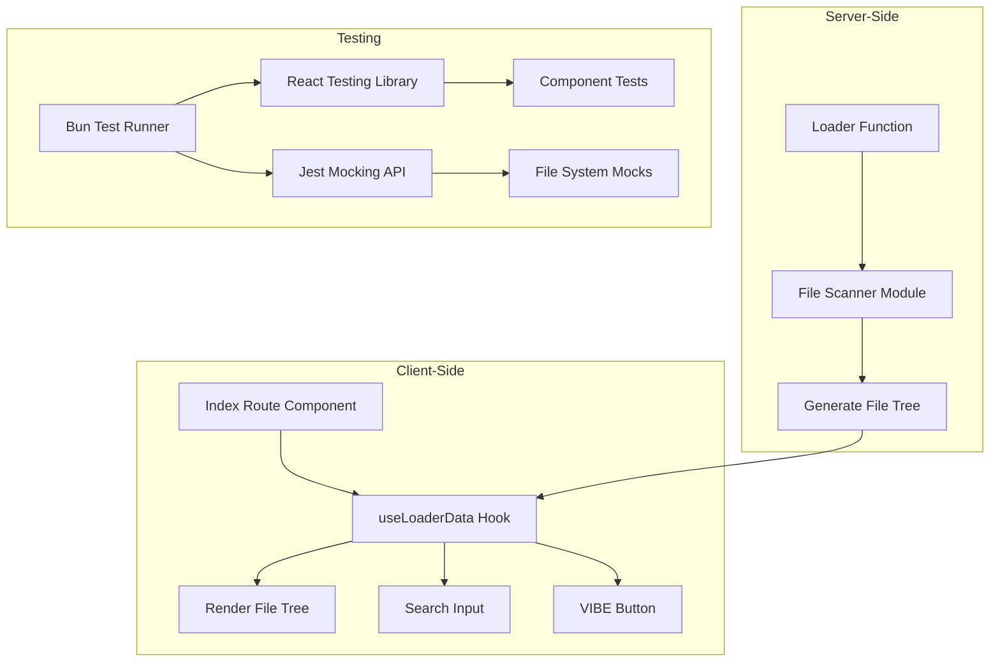
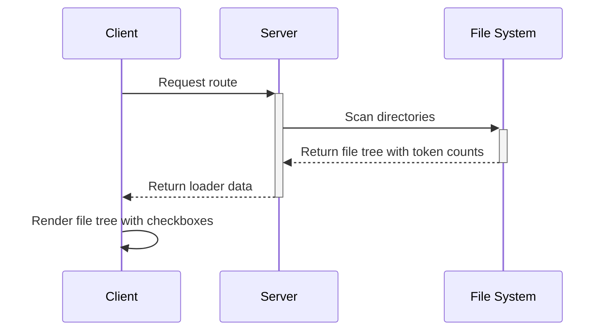

# Updated Implementation Plan: Server Data Loading and Bun Testing

## Overview

This plan outlines the implementation of server data loading functionality using **Bun's built-in test runner** for the React Router 7 starter template. Based on the provided sample UI in `sample.tsx`, we'll enhance the template with:

1.  A file system scanner that creates a nested tree structure matching the sample data structure.
2.  A loader in the index route that loads the file system data.
3.  Comprehensive tests using **Bun's test runner**, `@testing-library/react`, and Jest-compatible mocking.

## Architecture Diagram



## Data Flow Architecture



## Implementation Steps

### 1. Remove Vitest & Add Bun Types (If needed)

*(This step was performed interactively)*

```bash
# Remove Vitest dependencies (if previously added)
bun remove vitest @vitest/coverage-v8 @testing-library/jest-dom

# Ensure necessary testing libraries remain
bun add -d @testing-library/react jsdom

# Ensure bun-types are installed for Bun's test runner types
bun add -d bun-types
```

### 2. Create Updated File System Scanner Module

*(Code remains the same as previous version)*

Create a utility module that will scan the file system and generate a tree structure matching the sample:

```typescript
// app/lib/fileScanner.ts
import fs from 'node:fs';
import path from 'node:path';

export interface FileNode {
  name: string;
  tokens: number;
  type: "file" | "folder";
  checked: boolean;
  expanded?: boolean;
  children?: FileNode[];
  isPending?: boolean;
}

export interface FileData {
  root: FileNode;
}

// Helper function to calculate "tokens" (using file size as proxy)
function calculateTokens(filePath: string): number {
  try {
    const stats = fs.statSync(filePath);
    // Use file size as a proxy for token count
    // For real token counting, you would need a parser
    return Math.floor(stats.size / 4); // Rough estimate: 4 bytes per token
  } catch (error) {
    console.error(`Error calculating tokens for ${filePath}:`, error);
    return 0;
  }
}

export function scanDirectory(
  directoryPath: string,
  excludePatterns: RegExp[] = [],
  isPendingPatterns: RegExp[] = [/node_modules/, /\.git/, /build/]
): FileNode {
  const baseName = path.basename(directoryPath);

  // Check if directory should be marked as pending
  const isPending = isPendingPatterns.some(pattern => pattern.test(directoryPath));

  if (excludePatterns.some(pattern => pattern.test(directoryPath))) {
    return {
      name: baseName,
      tokens: 0,
      type: "folder",
      checked: true,
      expanded: false,
      children: [],
      isPending
    };
  }

  let totalTokens = 0;
  const children: FileNode[] = [];

  try {
    const entries = fs.readdirSync(directoryPath, { withFileTypes: true });

    for (const entry of entries) {
      const entryPath = path.join(directoryPath, entry.name);

      // Skip excluded directories/files based on the exclude pattern
      if (excludePatterns.some(pattern => pattern.test(entryPath))) {
        continue;
      }

      const entryIsPending = isPendingPatterns.some(pattern => pattern.test(entryPath));

      if (entry.isDirectory()) {
        // If the directory itself matches a pending pattern, mark it and don't recurse
        if (entryIsPending) {
           children.push({
             name: entry.name,
             tokens: 0, // Pending folders don't contribute tokens directly
             type: "folder",
             checked: true,
             expanded: false,
             children: [],
             isPending: true
           });
        } else {
          const subDir = scanDirectory(entryPath, excludePatterns, isPendingPatterns);
          children.push(subDir);
          totalTokens += subDir.tokens;
        }
      } else {
        const fileTokens = calculateTokens(entryPath);
        children.push({
          name: entry.name,
          tokens: fileTokens,
          type: "file",
          checked: true,
          isPending: false // Files are not marked pending individually here
        });
        totalTokens += fileTokens;
      }
    }
  } catch (error) {
    console.error(`Error scanning directory ${directoryPath}:`, error);
  }

  // Sort children: folders first, then files, alphabetically
  children.sort((a, b) => {
    if (a.type === 'folder' && b.type === 'file') return -1;
    if (a.type === 'file' && b.type === 'folder') return 1;
    return a.name.localeCompare(b.name);
  });

  return {
    name: baseName,
    tokens: totalTokens,
    type: "folder",
    checked: true,
    expanded: true, // Root node starts expanded
    children,
    isPending
  };
}

export function createFileData(rootDir: string, excludePatterns: RegExp[] = []): FileData {
  const rootNode = scanDirectory(rootDir, excludePatterns);
  return { root: rootNode };
}
```

### 3. Update Index Route with Loader and Sample UI

*(Code remains the same as previous version)*

```typescript
// app/routes/_index.tsx
import { useLoaderData } from 'react-router';
import { ChevronDown, ChevronRight } from 'lucide-react';
import { Button } from '~/components/ui/button';
import { Input } from '~/components/ui/input';
import { Checkbox } from '~/components/ui/checkbox';
import { createFileData, type FileData, type FileNode } from '~/lib/fileScanner';
import path from 'node:path';
import { useState } from 'react';

import type { Route } from './+types/_index';

export function meta(_: Route.MetaArgs) {
  return [
    { title: 'React Router App - File Explorer' },
    { name: 'description', content: 'File explorer with server data loading' },
  ];
}

export async function loader() {
  // Get the project root directory
  const rootDir = path.resolve('.');

  // Define patterns for directories whose *contents* should be excluded,
  // but the directory itself should be shown (and marked as pending).
  const excludeContentPatterns = [
    /node_modules\/.+/, // Matches anything inside node_modules
    /\.git\/.+/,       // Matches anything inside .git
    /build\/.+/,       // Matches anything inside build
    /public\/.+/,      // Matches anything inside public
    /memory-bank\/.+/  // Matches anything inside memory-bank
  ];

  // Scan the directory excluding specified patterns
  // isPendingPatterns are handled internally by scanDirectory defaults
  const fileData = createFileData(rootDir, excludeContentPatterns);

  // Loaders should return plain objects or Responses
  return fileData;
}

export default function Home() {
  // Assert the type since useLoaderData might be undefined initially
  const fileData = useLoaderData() as FileData;
  const [searchText, setSearchText] = useState("");
  const [localFileData, setLocalFileData] = useState<FileData>(fileData);

  // Toggle checkbox state recursively
  const toggleCheckboxRecursive = (node: FileNode, targetPath: string[], currentPath: string[]): FileNode => {
    const isMatch = currentPath.join('/') === targetPath.join('/');

    let newChecked = node.checked;
    if (isMatch) {
      newChecked = !node.checked;
    }

    let newChildren = node.children;
    if (node.children) {
      newChildren = node.children.map(child =>
        toggleCheckboxRecursive(child, targetPath, [...currentPath, child.name])
      );
      // If it's the target folder, update children's checked state as well
      if (isMatch && node.type === 'folder') {
         newChildren = newChildren?.map(child => ({ ...child, checked: newChecked }));
         // Recursively update grandchildren etc.
         const updateGrandChildren = (n: FileNode): FileNode => ({
            ...n,
            checked: newChecked,
            children: n.children?.map(updateGrandChildren)
         });
         newChildren = newChildren?.map(updateGrandChildren);
      }
    }

    return { ...node, checked: newChecked, children: newChildren };
  };

  const toggleCheckbox = (path: string[]) => {
    setLocalFileData(prevData => ({
      root: toggleCheckboxRecursive(prevData.root, path, [prevData.root.name])
    }));
  };


  // Toggle folder expansion
  const toggleFolderRecursive = (node: FileNode, targetPath: string[], currentPath: string[]): FileNode => {
     const isMatch = currentPath.join('/') === targetPath.join('/');

     let newExpanded = node.expanded;
     if (isMatch && node.type === 'folder') {
       newExpanded = !node.expanded;
     }

     let newChildren = node.children;
     if (node.children) {
       newChildren = node.children.map(child =>
         toggleFolderRecursive(child, targetPath, [...currentPath, child.name])
       );
     }

     return { ...node, expanded: newExpanded, children: newChildren };
   };

   const toggleFolder = (path: string[]) => {
     setLocalFileData(prevData => ({
       root: toggleFolderRecursive(prevData.root, path, [prevData.root.name])
     }));
   };


  // Recursive function to render file tree
  const renderFileTree = (node: FileNode, path: string[] = [node.name], level = 0): React.ReactNode => {
    const currentPath = path; // Path already includes current node name

    return (
      <div key={currentPath.join('/')} style={{ marginLeft: `${level * 16}px` }}>
        <div
          className={`flex items-center py-1 ${node.isPending ? 'text-blue-500 opacity-70' : ''}`}
        >
          <Checkbox
             className="mr-2"
             checked={node.checked}
             onCheckedChange={() => toggleCheckbox(currentPath)}
             id={currentPath.join('/')}
             disabled={node.isPending} // Disable checkbox for pending items
           />

          {node.type === 'folder' && !node.isPending && ( // Don't show toggle for pending folders
            <span
              className="mr-1 cursor-pointer"
              onClick={() => toggleFolder(currentPath)}
            >
              {node.expanded ? <ChevronDown size={16} /> : <ChevronRight size={16} />}
            </span>
          )}
           {node.type === 'folder' && node.isPending && ( // Placeholder for pending folders
             <span className="mr-1 w-4 inline-block"></span> // Keep alignment
           )}

          <label
            htmlFor={currentPath.join('/')}
            className={`mr-1 cursor-pointer ${!node.checked ? 'line-through opacity-50' : ''} ${node.isPending ? 'italic' : ''}`}
          >
            {node.name}
          </label>
          {!node.isPending && ( // Don't show tokens for pending folders
             <span className={`text-xs text-gray-500 ${!node.checked ? 'line-through opacity-50' : ''}`}>({node.tokens} tokens)</span>
           )}
           {node.isPending && (
              <span className="text-xs text-blue-500 italic">(pending scan)</span>
           )}
        </div>

        {node.type === 'folder' && node.expanded && node.children && !node.isPending && ( // Don't render children for pending
          <div>
            {node.children.map((child: FileNode) => renderFileTree(child, [...currentPath, child.name], level + 1))}
          </div>
        )}
      </div>
    );
  };

  const handleVibe = () => {
    // Handle the VIBE button click
    console.log("VIBE clicked with text:", searchText);
    // TODO: Implement actual VIBE functionality - filter nodes based on search?
  };

  return (
    <div className="bg-gray-900 text-gray-100 p-4 min-h-screen font-sans">
      <div className="max-w-4xl mx-auto">
        {/* Search bar and VIBE button */}
        <div className="flex mb-4 space-x-2 sticky top-4 bg-gray-900 py-2 z-10">
          <Input
            value={searchText}
            onChange={(e) => setSearchText(e.target.value)}
            placeholder="Filter files or add context..."
            className="flex-grow bg-gray-700 border-gray-600 text-gray-100 placeholder-gray-400 focus:ring-pink-500 focus:border-pink-500"
          />
          <Button
            onClick={handleVibe}
            className="bg-pink-600 hover:bg-pink-700 text-white font-bold"
          >
            VIBE
          </Button>
        </div>

        {/* File tree */}
        <div className="bg-gray-800 p-4 rounded-md text-white font-mono text-sm border border-gray-700 shadow-lg mt-4">
           {renderFileTree(localFileData.root)}
        </div>
      </div>
    </div>
  );
}
```

### 4. Remove Vitest Configuration

*(This step was performed interactively)*

Delete the `vitest.config.ts` file.

```bash
rm vitest.config.ts
```

### 5. Update Test Setup File

*(This step was performed interactively)*

Update `test/setup.ts` to remove Vitest-specific code.

```typescript
// test/setup.ts
// Setup file for Bun tests

// Import testing library cleanup if needed (might be handled by Bun)
// import { cleanup } from '@testing-library/react';

// afterEach(() => {
//   cleanup();
// });

// Add any other global setup needed for Bun's test environment
console.log("Bun test setup file loaded.");
```

### 6. Update tsconfig.json

*(This step was performed interactively)*

Ensure `compilerOptions.types` includes `"bun-types"` and remove `"vitest/globals"`.

```json
// tsconfig.json excerpt
{
  "compilerOptions": {
    // ... other options
    "types": ["node", "vite/client", "bun-types"] // Use bun-types
    // ... other options
  }
}
```

### 7. Adapt Tests for Bun/Jest Syntax

Update test files (`*.test.ts`) to use Bun/Jest syntax.

#### File Scanner Tests (`app/lib/fileScanner.test.ts`)

```typescript
// app/lib/fileScanner.test.ts
import { describe, it, expect, beforeEach, jest } from 'bun:test'; // Use bun:test imports/globals
import { scanDirectory, createFileData } from './fileScanner';
import fs, { Dirent, Stats } from 'node:fs';
import path from 'node:path';

// Mock the fs and path modules using Jest syntax
jest.mock('node:fs');
jest.mock('node:path');

// Helper type for mocked Dirent - includes parentPath and path
type MockDirent = Required<Pick<Dirent, 'name' | 'isFile' | 'isDirectory' | 'isSymbolicLink' | 'isBlockDevice' | 'isCharacterDevice' | 'isFIFO' | 'isSocket' | 'parentPath' | 'path'>> & Partial<Dirent>;

// Helper type for mocked Stats - use bigint for size as per TS error
type MockStats = Omit<Stats, 'size'> & { size: bigint } & Pick<Stats, 'isDirectory'> & Partial<Stats>;

// Helper function to create MockDirent objects
const createMockDirent = (name: string, isDirectory: boolean, parentPath: string): MockDirent => {
    const fullPath = `${parentPath}/${name}`; // Simple path join for mock
    return {
        name,
        isFile: () => !isDirectory,
        isDirectory: () => isDirectory,
        isBlockDevice: () => false,
        isCharacterDevice: () => false,
        isSymbolicLink: () => false,
        isFIFO: () => false,
        isSocket: () => false,
        parentPath: parentPath,
        path: fullPath, // Add path property
    };
};

describe('fileScanner', () => {
  // Cast mocked modules for type safety with mockImplementation etc.
  const mockedFs = fs as jest.Mocked<typeof fs>;
  const mockedPath = path as jest.Mocked<typeof path>;

  beforeEach(() => {
    // Reset mocks before each test using Jest's method
    jest.clearAllMocks();

    // Define mock implementations for the mocked modules within beforeEach
    mockedPath.basename.mockImplementation((p: string) => p.split('/').pop() || '');
    mockedPath.join.mockImplementation((...args: string[]) => args.join('/'));
    mockedPath.resolve.mockImplementation((p: string) => p); // Mock resolve

    mockedFs.statSync.mockImplementation((p: fs.PathLike): MockStats => ({ // Add type for p
      size: p.toString().includes('.txt') ? 400n : 200n, // Use bigint literal
      isDirectory: () => !p.toString().includes('.'),
      isFile: () => p.toString().includes('.'),
      isSymbolicLink: () => false,
    } as MockStats));

    mockedFs.readdirSync.mockImplementation((dirPath): MockDirent[] => {
      const parentPath = dirPath.toString();
      if (parentPath === '/test') {
        return [
          createMockDirent('file1.txt', false, parentPath),
          createMockDirent('dir1', true, parentPath),
          createMockDirent('node_modules', true, parentPath),
        ];
      }
      if (parentPath === '/test/dir1') {
        return [
          createMockDirent('file2.txt', false, parentPath),
        ];
      }
      if (parentPath === '/test/node_modules') {
        return [];
      }
      return [];
    });
    // Add other fs functions if needed
  });

  it('should scan a directory and return a tree structure with correct tokens', () => {
    const result = scanDirectory('/test');
    // ... (assertions remain the same) ...
    expect(result.name).toBe('test');
    expect(result.tokens).toBe(150);
    expect(result.children).toHaveLength(3);
    // ... more assertions
  });

  it('should exclude files/directories matching exclude patterns', () => {
     mockedFs.readdirSync.mockImplementation((dirPath): MockDirent[] => {
       const parentPath = dirPath.toString();
       if (parentPath === '/test') {
         return [
           createMockDirent('file1.txt', false, parentPath),
           createMockDirent('exclude_me.txt', false, parentPath),
           createMockDirent('dir1', true, parentPath),
         ];
       }
       return [];
     });

     const excludePatterns = [/exclude_me\.txt/];
     const result = scanDirectory('/test', excludePatterns);
     // ... (assertions remain the same) ...
     expect(result.children).toHaveLength(2);
     expect(result.tokens).toBe(100);
   });

  it('createFileData should wrap scanDirectory result in a root object', () => {
    const fileData = createFileData('/test');
    // ... (assertions remain the same) ...
    expect(fileData.root.name).toBe('test');
  });

  it('should handle errors during file system operations gracefully', () => {
     mockedFs.readdirSync.mockImplementation(() => {
       throw new Error('Permission denied');
     });
     const errorSpy = jest.spyOn(console, 'error').mockImplementation(() => {}); // Use jest.spyOn

     const result = scanDirectory('/test');
     // ... (assertions remain the same) ...
     expect(result.children).toEqual([]);
     expect(console.error).toHaveBeenCalled();

     errorSpy.mockRestore(); // Restore console.error
   });

   it('should sort children with folders first, then alphabetically', () => {
     mockedFs.readdirSync.mockImplementation((dirPath): MockDirent[] => {
       const parentPath = dirPath.toString();
       if (parentPath === '/test') {
         return [
           createMockDirent('z_file.txt', false, parentPath),
           createMockDirent('a_folder', true, parentPath),
           createMockDirent('b_file.txt', false, parentPath),
           createMockDirent('x_folder', true, parentPath),
         ];
       }
       return [];
     });

     const result = scanDirectory('/test');
     // ... (assertions remain the same) ...
     expect(result.children?.map(c => c.name)).toEqual([
       'a_folder',
       'x_folder',
       'b_file.txt',
       'z_file.txt',
     ]);
   });
});
```

#### Route Component Tests (`app/routes/_index.test.tsx`)

```typescript
// app/routes/_index.test.tsx
import { describe, it, expect, beforeEach, jest } from 'bun:test'; // Use bun:test imports/globals
import { render, screen, fireEvent } from '@testing-library/react';
import Home, { loader } from './_index';
import { createMemoryRouter, RouterProvider } from 'react-router';
import * as fileScanner from '~/lib/fileScanner';
import type { FileData } from '~/lib/fileScanner';

// Mock modules using Jest syntax
jest.mock('~/lib/fileScanner');
jest.mock('lucide-react', () => ({
  ChevronDown: () => <div data-testid="chevron-down">▼</div>,
  ChevronRight: () => <div data-testid="chevron-right">▶</div>,
}));

describe('Home component', () => {
  // Cast the mocked module
  const mockedFileScanner = fileScanner as jest.Mocked<typeof fileScanner>;

  beforeEach(() => {
    // Reset mocks before each test
    jest.clearAllMocks();
  });

  it('should render the file tree with checkboxes and handle interactions', async () => {
    // Mock the data returned by the loader
    const fileDataMock: FileData = { /* ... (same mock data as before) ... */
        root: {
            name: 'file-scope', tokens: 150, type: 'folder', checked: true, expanded: true, isPending: false, children: [
                { name: 'app', tokens: 100, type: 'folder', checked: true, expanded: true, isPending: false, children: [
                    { name: 'routes', tokens: 50, type: 'folder', checked: true, expanded: false, isPending: false, children: [
                        { name: '_index.tsx', tokens: 50, type: 'file', checked: true, isPending: false }
                    ]}
                ]},
                { name: 'README.md', tokens: 50, type: 'file', checked: true, isPending: false }
            ]
        }
    };

    // Configure the specific mock implementation for createFileData
    mockedFileScanner.createFileData.mockReturnValue(fileDataMock);

    // Create loader data by calling the actual loader (which now uses the mock)
    const loaderData = await loader();

    // Set up router with loader data
    const router = createMemoryRouter( /* ... (same router setup) ... */
      [ { path: '/', element: <Home />, loader: () => loaderData } ],
      { initialEntries: ['/'] }
    );

    render(<RouterProvider router={router} />);

    // ... (assertions remain the same) ...
    expect(screen.getByText('file-scope')).toBeInTheDocument();
    expect(screen.getByText('README.md')).toBeInTheDocument();
    // ... more assertions ...
  });
});
```

### 8. Update package.json Scripts

Ensure the `test` script uses `bun test`.

```json
// package.json excerpt
"scripts": {
  // ... other scripts
  "test": "bun test",
  "test:watch": "bun test --watch", // Optional watch script
  "test:coverage": "bun test --coverage" // Optional coverage script
  // ... other scripts
}
```

## Testing Strategy

```mermaid
flowchart TD
    A[Unit Tests] --> B(fileScanner.test.ts)
    D[Integration Tests] --> E(_index.test.tsx)
    F[Jest Mocking API] --> G[Mock File System (fs, path)]
    H[React Testing Library] --> I[Render & Interact with Component]
```

## Dependencies

*   **Keep:** `@testing-library/react`, `jsdom`
*   **Add:** `bun-types` (dev dependency)
*   **Remove:** `vitest`, `@vitest/coverage-v8`, `@testing-library/jest-dom`

## Key Differences from Vitest Plan

1.  **Test Runner**: Switched from Vitest to Bun's built-in runner.
2.  **Configuration**: Removed `vitest.config.ts`. Updated `tsconfig.json` types.
3.  **Mocking**: Replaced `vi.mock`/`vi.doMock`/`vi.mocked` with `jest.mock` and standard Jest mocking patterns.
4.  **Imports**: Test utility functions (`describe`, `it`, etc.) are imported from `bun:test`.
5.  **Dependencies**: Removed Vitest packages, added `bun-types`.

## Next Steps

1.  Ensure dependencies are correctly installed/removed.
2.  Implement the code changes in the test files.
3.  Run `bun test` to verify functionality.
4.  Update the README to document the testing setup.